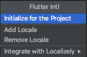
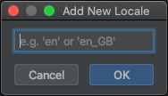

### Getting started
* Get dependencies and generate necessary files.
```
npm run init
```
* We'll handle the generation of required files for 🚀 your onboarding!

### Json parsing / serialization
This project is implementing [json_serializable](https://pub.dev/packages/json_serializable).
It use build_runner to generate files. If you make a change to these files, you need to re-run the generator using build_runner:
```
flutter pub run build_runner build
```
generator using build_runner and remove conflict file :
```
npm run generate
```

## Indentation.
- Auto indentation handled with git hook using [Lefthook](https://github.com/Arkweid/lefthook).
- For mac users, run `npm run setup` and you should be done. More details below.
- This project use npm for [Lefthook](https://github.com/Arkweid/lefthook) installation, to ease others getting it up running fast - run `npm install`
- After installation, run `npx lefthook install` to finish up installation.
- More info [here](https://github.com/Arkweid/lefthook/blob/master/docs/node.md).

### Localization
Using this library to handle multi-languages. Follow this guide to understand and config languages files

#### Setup Step :

* VSC, AS, IJ users need to install the plugins from the market.
* vs-code: https://marketplace.visualstudio.com/items?itemName=localizely.flutter-intl
* intelliJ / android studio: https://plugins.jetbrains.com/plugin/13666-flutter-intl

* others/CLI:
```
flutter pub global activate intl_utils

flutter pub global run intl_utils:generate
```

### Initialize plugins (IntelliJ reference)
1. Open Flutter intl in `Action`
2. Click on `Initialize for project`



3. To add / remove Locale, choose `Add Locale` / `Remove Locale`
4. Then it will promp which locale



**Current available locale is en, ms_MY**


Link library : https://pub.dev/packages/intl_utils

More details in [confluence](https://setelnow.atlassian.net/wiki/spaces/SL/pages/596640430/Flutter+Project+Structure#2.12.1.-Set-up-your-app)
